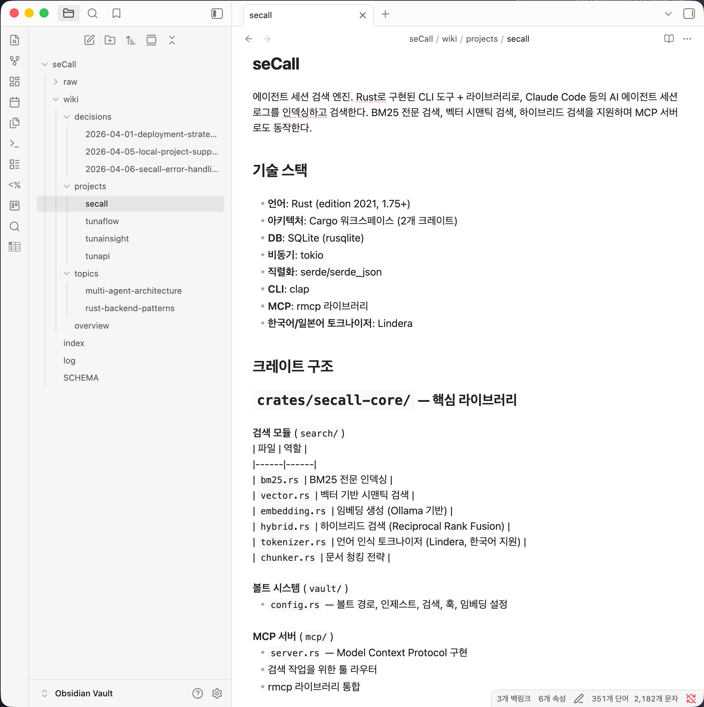

<div align="center">

# seCall

**Search everything you've ever discussed with AI agents.**

AI 에이전트와 나눈 모든 대화를 검색하세요.

[](https://www.rust-lang.org/)
[](https://www.sqlite.org/)
[](https://modelcontextprotocol.io/)
[](LICENSE)
[](https://onnxruntime.ai/)
[](https://obsidian.md/)

<br/>

**`English`** · [**`한국어`**](#한국어)

</div>

---

<div align="center">

<br/><br/>
</div>

## What is seCall?

seCall is a local-first search engine for AI agent sessions. It ingests conversation logs from **Claude Code**, **Codex CLI**, and **Gemini CLI**, indexes them with hybrid BM25 + vector search, and exposes them via CLI, MCP server, and an Obsidian-compatible knowledge vault.

Your AI conversations are a knowledge base. seCall makes them searchable, browsable, and interconnected.

### Why?

- You've discussed architecture, debugging steps, and design decisions across hundreds of agent sessions — but they're scattered in opaque JSONL files.
- seCall turns those sessions into a **structured, searchable knowledge graph** you can query from any MCP-compatible AI agent or browse in Obsidian.

## Features

### Multi-Agent Ingestion

Parse and normalize sessions from multiple AI coding agents into a unified format:

| Agent | Format | Status |
|---|---|---|
| Claude Code | JSONL | ✅ Stable |
| Codex CLI | JSONL | ✅ Stable |
| Gemini CLI | JSON | ✅ Stable |

### Hybrid Search

- **BM25 full-text search** powered by SQLite FTS5 with Korean morpheme tokenization ([Lindera](https://github.com/lindera/lindera) ko-dic)
- **Vector semantic search** using ONNX Runtime with BGE-M3 embeddings
- **Reciprocal Rank Fusion (RRF)** combining both results (k=60)
- **LLM query expansion** for natural language queries via Claude Code

### Knowledge Vault

Obsidian-compatible markdown vault with two layers:

```
vault/
├── raw/sessions/    # Immutable session transcripts
│   └── YYYY-MM-DD/  # Organized by date
└── wiki/            # AI-generated knowledge pages
    ├── projects/    # Per-project summaries
    ├── topics/      # Technical topic pages
    └── decisions/   # Architecture decision records
```

- **Wiki generation** via Claude Code meta-agent (`secall wiki update`)
- **Obsidian backlinks** (`[[]]`) connecting sessions ↔ wiki pages
- Frontmatter metadata for Dataview queries

### MCP Server

Expose your session index to any MCP-compatible AI agent:

```bash
# stdio mode (for Claude Code, Cursor, etc.)
secall mcp

# HTTP mode (for web clients)
secall mcp --http 127.0.0.1:8080
```

Tools provided: `recall`, `get`, `status` — letting your AI agent search its own conversation history.

### Data Integrity

Built-in lint rules verify index ↔ vault consistency:

```bash
secall lint
# L001: Missing vault files
# L002: Orphan vault files
# L003: FTS index gaps
# ...
```

## Quick Start

### Prerequisites

- Rust 1.75+
- At least one of: Claude Code, Codex CLI, Gemini CLI

### Install

```bash
git clone https://github.com/hang-in/seCall.git
cd seCall
cargo install --path crates/secall
```

### Initialize

```bash
# Point to your Obsidian vault (or any directory)
secall init --vault ~/Documents/Obsidian\ Vault/seCall
```

### Ingest Sessions

```bash
# Auto-detect Claude Code sessions
secall ingest --auto

# Ingest Codex CLI sessions
secall ingest ~/.codex/sessions

# Ingest Gemini CLI sessions
secall ingest ~/.gemini/sessions
```

### Search

```bash
# BM25 full-text search
secall recall "BM25 인덱싱 구현"

# Filter by project, agent, date
secall recall "에러 처리" --project seCall --agent claude-code --since 2026-04-01

# Vector-only semantic search
secall recall "how does the search pipeline work" --vec

# LLM-expanded query
secall recall "검색 정확도 개선" --expand
```

### Retrieve a Session

```bash
# Summary view
secall get <session-id>

# Full markdown content
secall get <session-id> --full

# Specific turn
secall get <session-id>:5
```

### Generate Wiki

```bash
# Claude Code analyzes sessions and generates wiki pages
secall wiki update

# Check wiki status
secall wiki status
```

## Architecture

```
┌─────────────┐     ┌──────────────┐     ┌──────────────┐
│  Claude Code │     │  Codex CLI   │     │  Gemini CLI  │
│    (JSONL)   │     │   (JSONL)    │     │    (JSON)    │
└──────┬───────┘     └──────┬───────┘     └──────┬───────┘
       │                    │                    │
       └────────────┬───────┴────────────────────┘
                    │
              ┌─────▼──────┐
              │   Parsers   │  claude.rs / codex.rs / gemini.rs
              └─────┬──────┘
                    │
          ┌─────────▼─────────┐
          │   Unified Session  │  Session → Turn → Action
          └─────────┬─────────┘
                    │
       ┌────────────┼────────────┐
       │            │            │
  ┌────▼────┐ ┌────▼────┐ ┌────▼────┐
  │ SQLite  │ │  Vault  │ │  Vector │
  │  FTS5   │ │   (MD)  │ │  Store  │
  │  BM25   │ │Obsidian │ │BGE-M3   │
  └────┬────┘ └─────────┘ └────┬────┘
       │                       │
       └───────────┬───────────┘
                   │
            ┌──────▼──────┐
            │  Hybrid RRF  │  k=60
            └──────┬──────┘
                   │
          ┌────────┼────────┐
          │        │        │
     ┌────▼──┐ ┌──▼───┐ ┌──▼──┐
     │  CLI  │ │ MCP  │ │Wiki │
     │recall │ │Server│ │Agent│
     └───────┘ └──────┘ └─────┘
```

## Tech Stack

| Category | Technology |
|---|---|
| Language | Rust 1.75+ (2021 edition) |
| Database | SQLite with FTS5 (rusqlite, bundled) |
| Korean NLP | Lindera ko-dic + Kiwi-rs morpheme analysis |
| Embeddings | ONNX Runtime + BGE-M3 (384-dim) |
| MCP Server | rmcp (stdio + Streamable HTTP via axum) |
| Vault | Obsidian-compatible Markdown |
| Wiki Engine | Claude Code meta-agent |

## CLI Reference

| Command | Description |
|---|---|
| `secall init` | Initialize vault, config, and database |
| `secall ingest [path] --auto` | Parse and index agent sessions |
| `secall recall <query>` | Hybrid search across sessions |
| `secall get <id>` | Retrieve session details |
| `secall status` | Show index statistics |
| `secall embed` | Generate vector embeddings |
| `secall lint` | Verify index/vault integrity |
| `secall mcp` | Start MCP server |
| `secall model download` | Download BGE-M3 ONNX model |
| `secall wiki update` | Generate wiki via Claude Code |

## MCP Integration

Add to your Claude Code settings (`~/.claude/settings.json`):

```json
{
  "mcpServers": {
    "secall": {
      "command": "secall",
      "args": ["mcp"]
    }
  }
}
```

For auto-ingest on session end:

```json
{
  "hooks": {
    "PostToolUse": [{
      "matcher": "Exit",
      "hooks": [{"type": "command", "command": "secall ingest --auto --cwd $PWD"}]
    }]
  }
}
```

## Acknowledgments

This project is built on ideas from:

- **[LLM Wiki](https://github.com/tobi/llm-wiki)** — The pattern of using LLMs to incrementally build and maintain a persistent, interlinked knowledge base from raw sources. seCall's two-layer vault architecture (raw sessions + AI-generated wiki) directly implements this concept.
- **[qmd](https://github.com/tobi/qmd)** by Tobi Lütke — A local search engine for markdown files with hybrid BM25/vector search. seCall's search pipeline (FTS5 BM25, vector embeddings, Reciprocal Rank Fusion with k=60) was designed with reference to qmd's approach.

This project was developed using AI coding agents (Claude Code, Codex) orchestrated via [tunaFlow](https://github.com/hang-in/tunaFlow), a multi-agent workflow platform.

## License

[AGPL-3.0](LICENSE)

---

<a id="한국어"></a>

<div align="center">

[**`English`**](#secall) · **`한국어`**

</div>

<div align="center">

<br/><br/>
</div>

## seCall이란?

seCall은 AI 에이전트 세션을 위한 로컬 퍼스트 검색 엔진입니다. **Claude Code**, **Codex CLI**, **Gemini CLI**의 대화 로그를 수집하고, BM25 + 벡터 하이브리드 검색으로 인덱싱하며, CLI/MCP 서버/Obsidian 호환 지식 볼트로 제공합니다.

AI와의 대화는 곧 지식 자산입니다. seCall은 그것을 검색 가능하고, 탐색 가능하며, 서로 연결된 형태로 만듭니다.

### 왜 필요한가?

- 수백 개의 에이전트 세션에 걸쳐 아키텍처, 디버깅, 설계 결정을 논의했지만 — 불투명한 JSONL 파일에 흩어져 있습니다.
- seCall은 이 세션들을 **구조화되고 검색 가능한 지식 그래프**로 변환합니다. MCP 호환 AI 에이전트에서 쿼리하거나 Obsidian에서 탐색할 수 있습니다.

## 주요 기능

### 멀티 에이전트 수집

여러 AI 코딩 에이전트의 세션을 통합 형식으로 파싱하고 정규화합니다:

| 에이전트 | 형식 | 상태 |
|---|---|---|
| Claude Code | JSONL | ✅ 안정 |
| Codex CLI | JSONL | ✅ 안정 |
| Gemini CLI | JSON | ✅ 안정 |

### 하이브리드 검색

- **BM25 전문 검색**: SQLite FTS5 + 한국어 형태소 분석 ([Lindera](https://github.com/lindera/lindera) ko-dic)
- **벡터 시맨틱 검색**: ONNX Runtime + BGE-M3 임베딩
- **Reciprocal Rank Fusion (RRF)**: 두 결과를 결합 (k=60)
- **LLM 쿼리 확장**: Claude Code를 통한 자연어 쿼리 확장

### 지식 볼트

Obsidian 호환 마크다운 볼트 (2계층 구조):

```
vault/
├── raw/sessions/    # 불변 세션 원본
│   └── YYYY-MM-DD/  # 날짜별 정리
└── wiki/            # AI 생성 지식 페이지
    ├── projects/    # 프로젝트별 요약
    ├── topics/      # 기술 주제 페이지
    └── decisions/   # 아키텍처 의사결정 기록
```

- **위키 생성**: Claude Code 메타에이전트 기반 (`secall wiki update`)
- **Obsidian 백링크** (`[[]]`)로 세션 ↔ 위키 페이지 연결
- Dataview 쿼리를 위한 frontmatter 메타데이터

### MCP 서버

MCP 호환 AI 에이전트에 세션 인덱스를 노출합니다:

```bash
# stdio 모드 (Claude Code, Cursor 등)
secall mcp

# HTTP 모드 (웹 클라이언트)
secall mcp --http 127.0.0.1:8080
```

제공 도구: `recall`, `get`, `status` — AI 에이전트가 자신의 대화 이력을 검색할 수 있습니다.

### 데이터 무결성

내장 린트 규칙으로 인덱스 ↔ 볼트 정합성을 검증합니다:

```bash
secall lint
# L001: 누락된 볼트 파일
# L002: 고아 볼트 파일
# L003: FTS 인덱스 갭
# ...
```

## 빠른 시작

### 사전 요구사항

- Rust 1.75+
- Claude Code, Codex CLI, Gemini CLI 중 하나 이상

### 설치

```bash
git clone https://github.com/hang-in/seCall.git
cd seCall
cargo install --path crates/secall
```

### 초기화

```bash
# Obsidian 볼트(또는 원하는 디렉토리)를 지정
secall init --vault ~/Documents/Obsidian\ Vault/seCall
```

### 세션 수집

```bash
# Claude Code 세션 자동 감지
secall ingest --auto

# Codex CLI 세션 수집
secall ingest ~/.codex/sessions

# Gemini CLI 세션 수집
secall ingest ~/.gemini/sessions
```

### 검색

```bash
# BM25 전문 검색
secall recall "BM25 인덱싱 구현"

# 프로젝트, 에이전트, 날짜 필터
secall recall "에러 처리" --project seCall --agent claude-code --since 2026-04-01

# 벡터 시맨틱 검색
secall recall "검색 파이프라인 동작 방식" --vec

# LLM 쿼리 확장
secall recall "검색 정확도 개선" --expand
```

### 세션 조회

```bash
# 요약 보기
secall get <session-id>

# 전체 마크다운
secall get <session-id> --full

# 특정 턴
secall get <session-id>:5
```

### 위키 생성

```bash
# Claude Code가 세션을 분석하고 위키 페이지를 생성
secall wiki update

# 위키 상태 확인
secall wiki status
```

## 아키텍처

```
┌─────────────┐     ┌──────────────┐     ┌──────────────┐
│  Claude Code │     │  Codex CLI   │     │  Gemini CLI  │
│    (JSONL)   │     │   (JSONL)    │     │    (JSON)    │
└──────┬───────┘     └──────┬───────┘     └──────┬───────┘
       │                    │                    │
       └────────────┬───────┴────────────────────┘
                    │
              ┌─────▼──────┐
              │   파서들     │  claude.rs / codex.rs / gemini.rs
              └─────┬──────┘
                    │
          ┌─────────▼─────────┐
          │   통합 세션 모델    │  Session → Turn → Action
          └─────────┬─────────┘
                    │
       ┌────────────┼────────────┐
       │            │            │
  ┌────▼────┐ ┌────▼────┐ ┌────▼────┐
  │ SQLite  │ │  볼트   │ │  벡터   │
  │  FTS5   │ │  (MD)   │ │  스토어 │
  │  BM25   │ │Obsidian │ │ BGE-M3  │
  └────┬────┘ └─────────┘ └────┬────┘
       │                       │
       └───────────┬───────────┘
                   │
            ┌──────▼──────┐
            │ 하이브리드 RRF │  k=60
            └──────┬──────┘
                   │
          ┌────────┼────────┐
          │        │        │
     ┌────▼──┐ ┌──▼───┐ ┌──▼──┐
     │  CLI  │ │ MCP  │ │위키 │
     │recall │ │서버   │ │에이전트│
     └───────┘ └──────┘ └─────┘
```

## 기술 스택

| 분류 | 기술 |
|---|---|
| 언어 | Rust 1.75+ (2021 에디션) |
| 데이터베이스 | SQLite + FTS5 (rusqlite, bundled) |
| 한국어 NLP | Lindera ko-dic + Kiwi-rs 형태소 분석 |
| 임베딩 | ONNX Runtime + BGE-M3 (384차원) |
| MCP 서버 | rmcp (stdio + Streamable HTTP / axum) |
| 볼트 | Obsidian 호환 Markdown |
| 위키 엔진 | Claude Code 메타에이전트 |

## MCP 연동

Claude Code 설정 (`~/.claude/settings.json`)에 추가:

```json
{
  "mcpServers": {
    "secall": {
      "command": "secall",
      "args": ["mcp"]
    }
  }
}
```

세션 종료 시 자동 수집:

```json
{
  "hooks": {
    "PostToolUse": [{
      "matcher": "Exit",
      "hooks": [{"type": "command", "command": "secall ingest --auto --cwd $PWD"}]
    }]
  }
}
```

## 출처

이 프로젝트는 다음 아이디어와 프로젝트를 기반으로 합니다:

- **[LLM Wiki](https://github.com/tobi/llm-wiki)** — LLM을 사용하여 원본 소스로부터 지속적이고 상호 연결된 지식 베이스를 점진적으로 구축하는 패턴. seCall의 2계층 볼트 아키텍처(원본 세션 + AI 생성 위키)는 이 컨셉을 직접 구현한 것입니다.
- **[qmd](https://github.com/tobi/qmd)** (Tobi Lütke) — 마크다운 파일을 위한 로컬 검색 엔진으로, BM25/벡터 하이브리드 검색을 지원합니다. seCall의 검색 파이프라인(FTS5 BM25, 벡터 임베딩, RRF k=60)은 qmd의 접근 방식을 참고하여 설계되었습니다.

이 프로젝트는 AI 코딩 에이전트(Claude Code, Codex)를 [tunaFlow](https://github.com/hang-in/tunaFlow) 멀티에이전트 워크플로우 플랫폼으로 오케스트레이션하여 개발되었습니다.

## 라이선스

[AGPL-3.0](LICENSE)

---

<div align="center">

**Contact**: [d9ng@outlook.com](mailto:d9ng@outlook.com)

</div>
